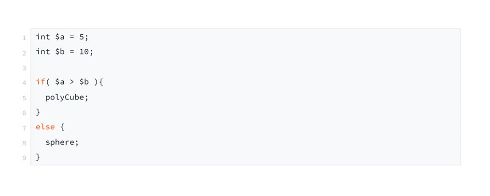
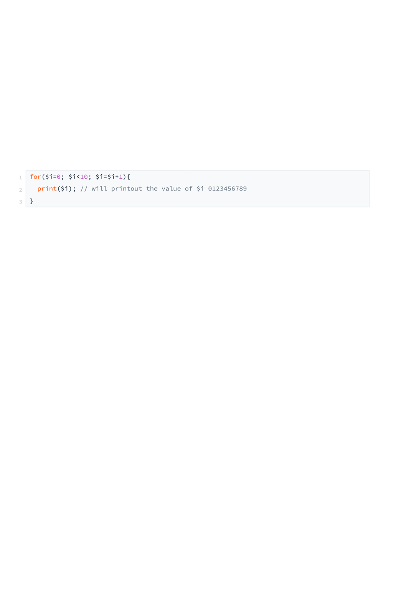

# Variables & simple Logic

## Variables

1.) Numbers
```
int $numCubes = 25; 
float $pi = 3.14;
```

2.) Strings
```string $myName = "Tony";```

3.) Vector
```vector $origin = <<0,0,0>>;```

4.) Array
```int $int_array[] = {10,9,8,7,6,5,4,3,2,1,0};```


## Logic

### If Conditions

if ( condition ) {
  do something
}
else {
  do something
}



### Operators 
```
if($a==$b) // if a is equal to b
if($a>b$) // if a is greater than to b
if($a>=$b) // if a is greater than or equal to b
if($a<$b) // if a is less than b
if($a<=$b)
```


### Loops
A loop is a repetition statement. → for( start; end; step ) {do something;}



<b>Example</b>

break; = exit the loop

continue; = skip one iteration

```
for($i=0; $i<20; $i++){ 
  if($i == 3) continue;
  if($i > 7) break;
  print $i;
}
```
