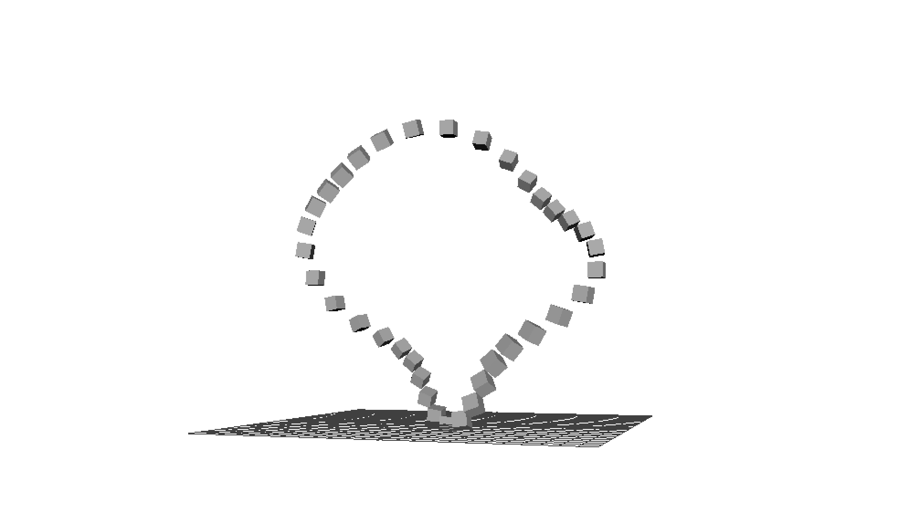

# Useful Snippets 2.0


## Number Patterns

Examples
```
for($i=0; $i<20; $i++){
$x = $i/2;
polyCube;
move ($i*2) 0 0;
scale 1 $x 1;
};
//00112233445566778899
```

```
for($i=0; $i<20; $i++){
$x = ($i%4)/3;
polyCube;
move $i 0 0;
scale 1 $x 1;
};
//00010001000100010010
```

```
for($i=0; $i<20; $i++){
$x = $i%2;
polyCube;
move $i 0 0;
scale 1 $x 1;
};
//00110011001100110011
```


## Something

```
int $k = 1;
for ($x=0; $x<10; $x++) {
	for ($y=0; $y<10; $y++){ 
		$name = "MyCube" + $k;
		polyCube -name $name;
		move ($x*2) ($y*2) 0;
		eval("select -r MyCube"+$k+".e[6]") ;
		float $xoff = rand(-.2, .2);
		float $yoff = rand(-.2, .2);
		move -r $xoff $yoff 0;
		eval("select -r MyCube"+$k+".e[7]") ;
		float $xoff = rand(-.2, .2);
		float $yoff = rand(-.2, .2);
		move -r $xoff $yoff 0;
		eval("select -r MyCube"+$k+".e[10]") ;
		float $xoff = rand(-.2, .2);
		float $yoff = rand(-.2, .2);
		move -r $xoff $yoff 0;
		eval("select -r MyCube"+$k+".e[11]") ;
		float $xoff = rand(-.2, .2);
		float $yoff = rand(-.2, .2);
		move -r $xoff $yoff 0;
		$k++;
	}
}
```


## Set Attributes example
```
// setting a value from a set of objects
for($i=0; $i<10; $i++){
	string $s = "MyCube" + $i;
	polyCube -name $s;
	move ($i*2) 0 0 ;
}
setAttr MyCube3.translateZ 4;

int $indx = 3;
eval("setAttr MyCube" + $indx + ".translateZ 7");
```

## Get Attributes example
```
// getting a value from a set of objects
for($i=0; $i<10; $i++){
	string $s = "MyCube" + $i;
	polyCube -name $s;
	move ($i*2) 0 0 ;
}

int $indx = rand(9);

eval("getAttr MyCube" + $indx + ".translateX");
```

## Greate Random Objects 
generate random objects by using a Function. If you want to add an Attribute (Variable) to the function – use the ```string $text``` input.


```
string $some_text="hello world";
eval( "createObjects($some_text);" );

proc createObjects(string $text) {
        string $commands[] = { "polyCone", "polyCube", "polySphere", "polyTorus" };
        print($text);

        for( $i=-10; $i<=10; $i+=2 ) {
                for( $j=-10; $j<=10; $j+=2 ) {        
                        // generate a random number to use as an index into the commands array
                        int $index = `rand 4`;
                                
                        // call eval to execute the command
                        eval($commands[$index]);
                        
                        // move the object
                        xform -t $i 0 $j;
                }
        }
}
```


## LOFT

This command computes a skinned (lofted) surface passing through a number of NURBS curves.


``` 
string $allCircles = "";
for ($t = 1; $t < 80; $t++) {
        $ang = rand(45,360); 
        $rad = rand(0.2,3.8);
        $siz = rand(2,0.2);
        circle -nr 0 0 0 -c 0 0 0 -sw 360 -r $rad;
        move 0 0 ($t * -0.5); 

        select -r ("nurbsCircle" + $t + ".cv[" + (rand(0,2)) + "]");
        move -r 0 (rand(2,0.2)) 0 ;   
        
        $allCircles = $allCircles + (" nurbsCircle" + $t);

}
eval("loft " + $allCircles);
```


## open lofted shape


```
string $allCircles = "";
for ($t = 1; $t < 80; $t++) {
        $ang = rand(45,360); 
        $rad = rand(2.2,3.8);
        circle -nr 0 0 0 -c 0 0 0 -sw 180 -r $rad;
        move 0 0 ($t * -1.5); 
        //rotate -z 120;
        //select -r ("nurbsCircle" + $t + ".cv[0]");
        select -r ("nurbsCircle" + $t + ".cv[" + (rand(0,2)) + "]");
        move -r 0 (rand(2,1)) 0 ;   
        
        // create string with all names
        $allCircles = $allCircles + (" nurbsCircle" + $t);

}
eval("loft " + $allCircles);
```

## Triangle Pattern
This snippet creates a Grid of triangles with a row of triangles rotated every second time.


```
proc makeIsosTriangleC() {
for ($i = 0; $i < 10; $i++) {

    for ($t = 0; $t < 10; $t++) {

        string $tmp[] = `polyPlane -w 1 -h 1 -sx 1 -sy 1 -ch 0`;
        $tmp = `listRelatives -c -type "shape" $tmp[0]`;
        string $planeShape = $tmp[0];
        eval("polyMergeVertex -am 1 -ch 0 "+$planeShape+".vtx[2] "+$planeShape+".vtx[3]");
        move ($t * 1.2) 0 ($i/2);
        print ($i + "\n"); 
        select $planeShape; 


        if ($i % 2 == 0) {
            rotate 0 180 0;
            move -r -0.6 0 (.3);

        }  
        //print ("pPlane" + ($i+1));
        //print ("pPlane" + ($t+1));

     }
}

}
makeIsosTriangleC();
```


## Open shapes
Used seed() to define the seed of random. 


```
seed(1);

for($i=-20; $i<20; $i=$i+2){
    for($j=-10; $j<10; $j=$j+3){
        $x = rand(-10,10);
        if($i < 0){
        sphere;
        }else{
        sphere -ssw 0 -esw -180;                    
        }
        move  0 ($i*40+$x) ($j*30);
        scale ($i+30) ($i+30) ($i+30);
        rotate 0 ($i*9) 0;
        rotate -p 0 0 0  0 ($j*7) 0;
    }
}

for($i=-20; $i<20; $i=$i+2){
    for($j=-10; $j<10; $j=$j+3){
        $x = rand(-10,10);
        
        move  0 ($i*40+$x) ($j*30);
        rotate -p 0 0 0  0 ($j*7) 0;
    }
}


string $obj = "nurbsSphere75";
float $pos[] = `xform -q -ws -t ($obj + ".cv[1]")`;


string $objB = "nurbsSphere75";
float $posB[] = `pointPosition ($objB + ".cv[0]")`;


string $objC = "nurbsSphere68";
float $posC[] = `objectCenter -gl $objC`;
sphere;
move $posC[0] $posC[1] $posC[2];
//$test = pointPosition nurbsSphere69.cv[1];
//print($test);
//print val(getAttr())

```


## Wave circles


```
for ($i = 1; $i <= 100; $i++) {
  $amp = 1;
  $per = sin(deg_to_rad($i*10));
  $sinFunc = ($amp * $per);

polyTorus -r (0.1 * $i) -sr 0.01;
//scale -r 1 1 1;
move 0 $sinFunc 0;
//rotate ($sinFunc*$i) 0 0;
}
```

### Chaos


```
for ($i = 1; $i <= 100; $i++) {
  $amp = 1;
  $per = sin(deg_to_rad($i*10));
  $sinFunc = ($amp * $per);

polyTorus -r (0.1 * $i) -sr 0.01;
move 0 $sinFunc 0;
rotate ($sinFunc*$i) 0 0;
}
```
## Closed – play with sine


```
for ($i = 1; $i <= 100; $i++ ) {
        
        $amp = 40;
          $per = sin(deg_to_rad($i*20));
         $sinFunc = ($amp * $per);

        
        polyCube -n ("Cube_" + $i);
        rotate -pivot 0 0 10 $sinFunc (($i * 10) + "deg") 0;
        // rotate the cube 180 degrees about its local space Y axis
        // centered at the rotate pivot point 1 0 0.
}
```

## Sine in every axis


```
for ($i = 0; $i < 400; $i++ ) {
    // Sin X
    $ampX = 2;
    $perX = $i*10;
    $sinFuncX = ($ampX * sin(deg_to_rad($perX)));
    
    // Cos Y
    $ampY = 2;
    $perY = $i*10;
    $sinFuncY = ($ampY * cos(deg_to_rad($perY))); 
    
    // Sin Z
    $ampZ = 2;
    $perZ = $i*40;
    $sinFuncZ = ($ampZ * sin(deg_to_rad($perZ))); 
    
    $varS = ($i*0.002 + 0.1);
    sphere -n ("$Sphere" + $i);
    scale  $varS $varS $varS;
    move ($sinFuncX * (($i)/40)) ($sinFuncY*(($i)/40)) ($sinFuncZ) ;
} 
```
