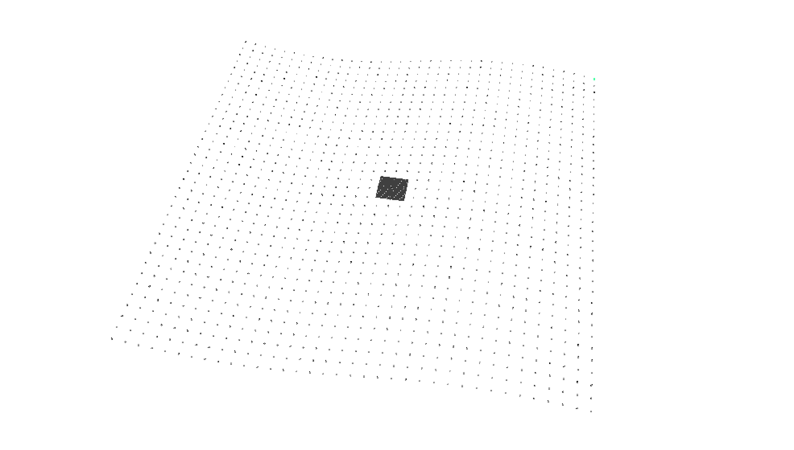
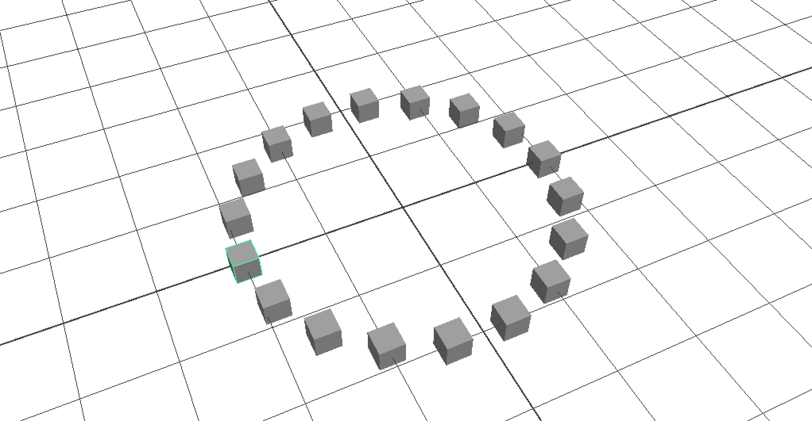
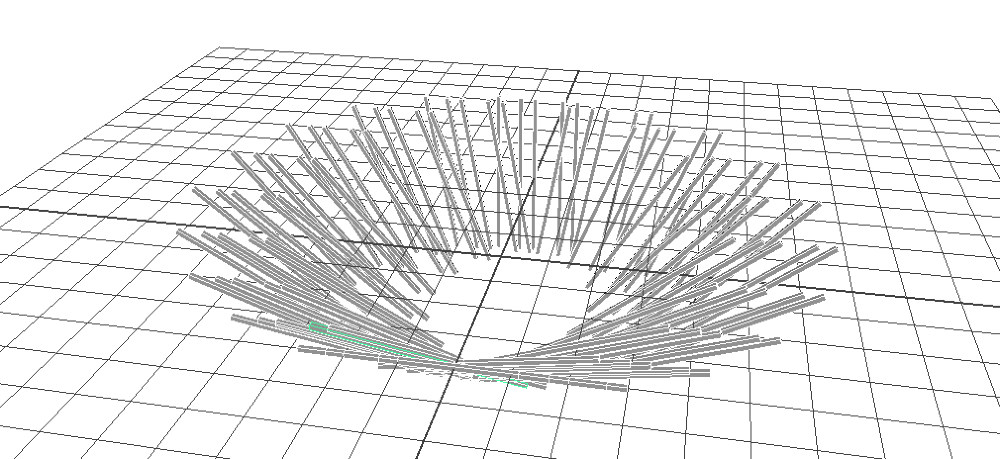

# Sin & Cos


```sin(float $angle);``` // Sine of an angle in radians
```cos(float $angle);``` // Cos of an angle in radians

```deg_to_rad(float $angle);``` // degrees to radians
```rad_to_deg(float $angle);``` // radians to degrees

```float $c = cos(deg_to_rad(90));``` // $c should be 0


## Sin Grid



```
for($x=-180; $x<180; $x+=10){
  for($y=-180; $y<180; $y+=10){
    float $sinang = 10. * sin( deg_to_rad( $x ) );
    polyCube;
    move $x $y $sinang;
  }
};
```

Add $y → sin( deg_to_rad( $x + $y )


# Sin & Cos = Circle


```
for ($i = 0; $i < 100; $i++ ) {
  // Sin X
  $ampX = 2;
  $perX = sin(deg_to_rad($i*20));
  $sinFuncX = ($ampX * $perX);

  // Sin Y
  $ampY = 2;
  $perY = cos(deg_to_rad($i*20));
  $sinFuncY = ($ampY * $perY); 


  polyCube -n ("$Cube_" + $i);
  scale 0.3 0.3 0.3;
  move $sinFuncX $sinFuncY 0 ;   
}
```

# Explore Sin&Cos



```
for ($i = 0; $i < 100; $i++ ) {
  // Sin X
  $ampX = 4;
  $perX = sin(deg_to_rad($i*20));
  $sinFuncX = ($ampX * $perX);

  // Sin Y
  $ampY = 4;
  $perY = cos(deg_to_rad($i*20));
  $sinFuncY = ($ampY * $perY); 


  polyCube -n ("$Cube_" + $i);
  scale 4 0.1 0.1;
  rotate 0 ($i * 10) 0;  
  move ($sinFuncX + (sin(deg_to_rad($i/20)*200))) $sinFuncY 0 ;     
}
```
