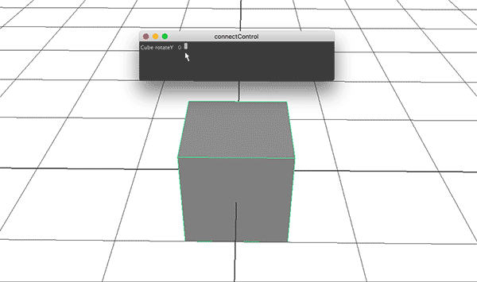

# GUI

You can create your own tools! Create a window and input fields, to boost your process 

```
// delete window when it exists
if ( `window -exists MyWindow` ) {
    deleteUI MyWindow; 
}

// Create a window 
window -t "Create Cubes" MyWindow;
 
//Define Layout
columnLayout MyMainCol;
intFieldGrp -l "Number" numberOfCubes;
button -l "Create" -command "createCubeButtonAction()";
 
showWindow MyWindow;
 
 
global proc createCubeButtonAction() {
  // read the control for the number of cubes to be created
  int $num = `intFieldGrp -q -v1 numberOfCubes`;
  for ($i=0;$i<$num;$i++ ) {
      polyCube;
      move (2*$i) 0 0;
  }
}
```

# GUI - Slider



```
proc createWindow() {

	if ( `window -exists MyWindow` ) {
	    deleteUI MyWindow; 
	}
	
	string $CubeA[] = `polyCube`; 
	string $Cube = $CubeA[0];
	
	
	// Create a window 
	window -t "connectControl" MyWindow;
	string $form = `formLayout`;
	
	// Create a slider
	string $label = `text -label "Cube rotateY" -align "right"`;
	string $field = `floatField -min 0.0 -max 360.0 -precision 2`;
	string $slider = `floatSlider -min 0.0 -max 360.0`;
	
	// Connect the sphere's Y rotation to the controls
	connectControl $field ( $Cube + ".rotateY" );
	connectControl $slider ( $Cube + ".rotateY" );
	
	// Edit the formLayout
	formLayout -e
	  -af   $label    top   6
	  -af   $label    left  2
	  -af   $field    top   2
	  -ac   $field    left  4   $label
	  -af   $slider   top   2
	  -ac   $slider   left  2   $field
	  -af   $slider   right 2
	    $form;
	
	showWindow MyWindow;
}

createWindow();
```


# GUI – Simple Slider x,y,z
```
window;
columnLayout;

//Create slider
text -l "X Value:";
string $sliderX = `floatSlider -min 0.0 -max 20.`;
text -l "Y Value:";
string $sliderY = `floatSlider -min 0.0 -max 20.`;
text -l "Z Value:";
string $sliderZ = `floatSlider -min 0.0 -max 20.`;


//show window
showWindow;


polySphere;
polyCube;
move 0 2 0;

connectControl $sliderX pCube1.tx pSphere1.tx;
connectControl $sliderY pCube1.ty pSphere1.ty;
connectControl $sliderZ pCube1.tz pSphere1.tz;
```

