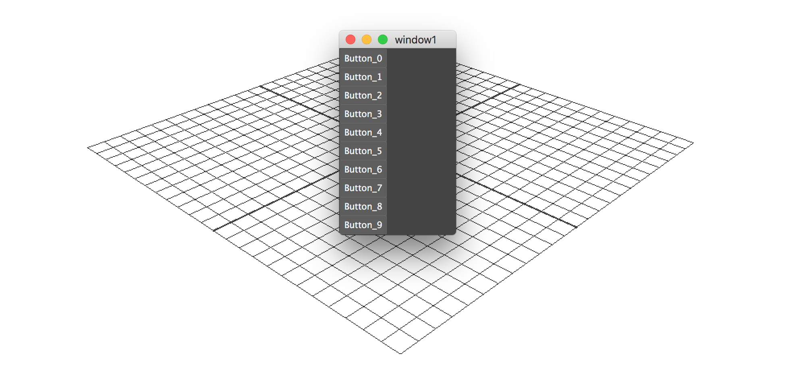

## Create a Window with 10 Buttons

from functools import partial
import maya.cmds as cmds

class ButtonWin(object):
   def __init__(self):
      self.win = cmds.window()
      self.layout = cmds.columnLayout(parent=self.win)
      for x in range(10):
         cmds.button(label="Button_%d"%x, parent=self.layout, command=partial(self.report,x))
         cmds.showWindow()
   def report(self,buttonIndex,value):
      print "button %d got %s"%(buttonIndex,value)
f = ButtonWin()
