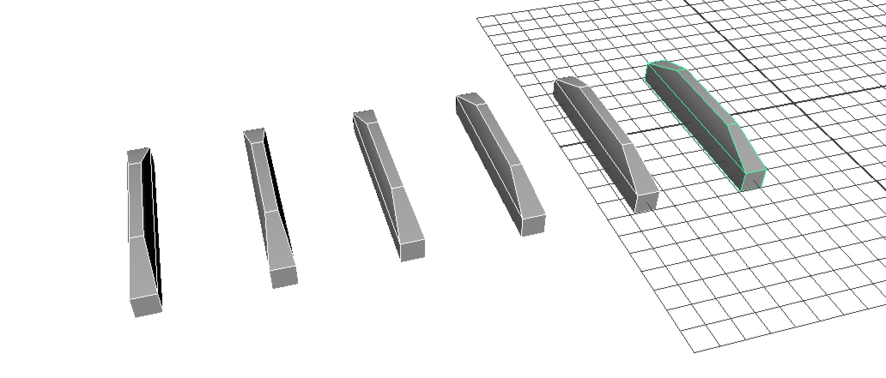

## The Python history

## Simple python commands

import maya.cmds as cmds

cmds.select( all=True )
cmds.delete()

for n in range(0,4):
	for i in range(0,10):
		cmds.polyCube( h=20 , d=2 )
		cmds.move( i*2, n*8, 1 )
		cmds.rotate(i*20)
		
for i in range(0,10):
	x = (i%4)/2;
	print x

## Create a Window with 10 Buttons

from functools import partial
import maya.cmds as cmds

class ButtonWin(object):
   def __init__(self):
      self.win = cmds.window()
      self.layout = cmds.columnLayout(parent=self.win)
      for x in range(10):
         cmds.button(label="Button_%d"%x, parent=self.layout, command=partial(self.report,x))
         cmds.showWindow()
   def report(self,buttonIndex,value):
      print "button %d got %s"%(buttonIndex,value)
f = ButtonWin()

## Extrude Faces

import maya.cmds as cmds

for i in range(1,7):
	hsbcBuilding = cmds.polyCube(h=9,n="HSBC")
	cmds.move((i*10 )/2.0, 0,0,hsbcBuilding)
	cmds.polyExtrudeFacet( hsbcBuilding[0] +".f[2]", ltz = 0.9, ls=( .5, .5, 0)	)
	

