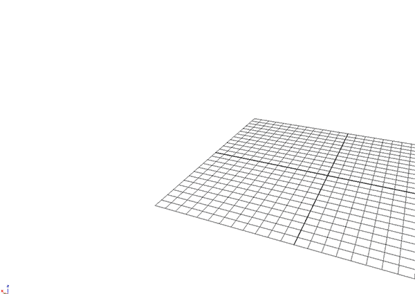

# GENERATIVE DESIGN – ALPHABET

Quickly generate objects shaped by character inputs. An alternative way of generate 3D designs 



## Define the Input
The values are defined according to the order the letter has in the alphabet.

```
int $AllPositionAscii[];
int $AllPositionAlphabet[];

$alphabet = ".abcdefghijklmnopqrstuvwxyz ";


// my Input
string $input = "Hello World";
$strSize=size($input);


//search position in alphabet
for($i=1; $i<=$strSize; $i++){
    $letter = substring($input, $i, $i);
  
    for ($t=1; $t <= (size($alphabet)); $t++){    
        if ($letter == (substring($alphabet, $t, $t)) ) {
        $AllPositionAlphabet[($i-1)] = $t; 
        }

    }
};
// Print it
for($i=0; $i<size($AllPositionAlphabet); $i++)
   print (substring($input, ($i+1), ($i+1)) + " : "+$AllPositionAlphabet[$i]+"\n");
```


# Create a Window and size cubes in relation to the input

```
select -all;
delete;
//-------------------------------DEFINE WINDOW-----------------------------------

// delete window if exists
if ( `window -exists MyWindow` ) {
    deleteUI MyWindow; 
}

// Create a window 
window -t "MyWindow" MyWindow;
 
//Define Layout
columnLayout MyMainCol;
textFieldButtonGrp -label "the_label" -text "some_text" numberOfCubes;

button -l "Run" -command "createCubeButtonAction()";
 
// lets pop up
showWindow MyWindow;


//-----------------------------------DO SOMETHIN (FUNCTION)------------------------------- 
global proc createCubeButtonAction() {
  // read the control for the number of cubes to be created
  string $currentInput = `textFieldGrp -q -text numberOfCubes`;

	

	//-----------------------------------YOUR CODE START------------------------------- 
		int $AllPositionAlphabet[];
	$alphabet = " abcdefghijklmnopqrstuvwxyz_";
	
	
	
	// my Input
	string $input = $currentInput;
	$strSize=size($input);
	
	
	//search position in alphabet
	for($i=1; $i<=$strSize; $i++){
	    $letter = substring($input, $i, $i);
	  
	    for ($t=1; $t <= (size($alphabet)); $t++){    
	        if ($letter == (substring($alphabet, $t, $t)) ) {
	        $AllPositionAlphabet[($i-1)] = $t; 
	        }
	
	    }
	};
	// Print it
	for($i=0; $i<size($AllPositionAlphabet); $i++)
	   print (substring($input, ($i+1), ($i+1)) + " : "+$AllPositionAlphabet[$i]+"\n");
	//-----------------------------------YOUR CODE END------------------------------- 


	// MAGIC
	for ($i = 0; $i < size($input); $i++) {
		polyCube;
		move ($i*2) 0 0;
		scale 1 1 $AllPositionAlphabet[$i];
	}
}
```


