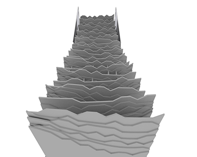

# Parametric Skyscraper

While studying in Shanghai at the [Tongji D&I](http://tjdi.tongji.edu.cn/), I created in collaboration with @vktr krtwg a generative designed skyscraper. We created the skyscraper design through the implementation of algorithms to the design process in order to study new ways of inspiration & creation.


## Structure

Plateau – Surface – Structure


## Code

```
comming soon!

```

##Details




