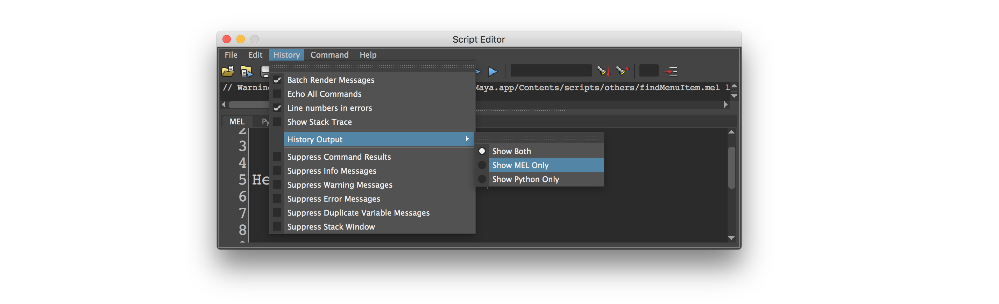

# Parametric-Design
Code-basics scipted in MEL & PYTHON in the Autodesk Maya environment.

Are you ever curious to dive into programming in Maya? Are looking to take your work to the next level and challenge yourself and explore new opportunities by explorations in creativity through the practice of programming? – then start with generative design in Maya

Inspired by Kosta Terzidis class „Parametric Design“ and some projects & experience I did before at the HfG Schwäisch Gmünd I started this Repository to share my experience and Insights.  
Here I will provide you with some Basics to start so you can get familiar with scripting in Maya. In addition I try to provide more and more code snippets in MEL & Python – stay tuned!

I can't vouch that all of this information is 100% correct. !! use it at your own risk !! If anyone spots any errors, then please do let me know....

# Lets Get Started

Open Maya and find the Mel and Python Editor. Click on the icon in bottom-right corner 

If you don‘t see it? – Then got to ***WINDOWS -> GENERAL EDITORS -> SCRIPT EDITOR***

## Step One – Monitoring the Command History

This History will be your best friend! Amazingly Maya is printing here almost all actions that you perform in the UI. So you create a cube just by using the normal UI and the history will show you the MEL command for the used action. In addition the Command History displays any feedback such as results, warnings, or errors returned by Maya.

## Step Two – Copy & paste

Now you can start creating something new by copy and paste commands to create your own worklfow. Just copy from the History panel the commands you need and paste in the Editor panel to piece together your custom automation work flow.

  

## Step Three – Memorize documentation

o look up the different commands you can find these in the Help Documentation, hot-key F1.

## Step Four – Saving your mind blowing Snippets

Once you have put together a script, you can drag it into the shelf inside the Maya UI to save it for later and re-use it over and over. 
1. To complete this highlight your new script:
2. Press the 'Alt' key while dragging your highlighted script into the Shelf tab of your choice, you are then prompted with whether the code is MEL or Python:
3. Windows->UI Elements->Shelf

Or Just add -> scriptToShelf  ("Mylabel", "select -all", true); <- at the end of your script and run it.

file -f -new;

polySphere -ch on -o on -r 7;
nurbsCube -p 0 0 0;
polySphere -ch on -o on -r 2.5;

select -r pSphere1 nurbsCube1 pSphere2;

group;

scriptToShelf  ("MyFirst", "select -all", true);

