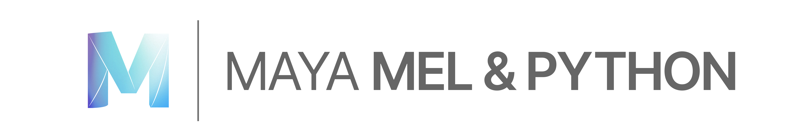

# Parametric-Design
Code-basics scipted in MEL & PYTHON in the Autodesk Maya environment.

Are you ever curious to dive into programming in Maya? Are looking to take your work to the next level and challenge yourself and explore new opportunities by explorations in creativity through the practice of programming? – then start with generative design in Maya

Inspired by Kosta Terzidis class „Parametric Design“ and some projects & experience I did before at the HfG Schwäisch Gmünd I started this Repository to share my experience and Insights.  
Here I will provide you with some Basics to start so you can get familiar with scripting in Maya. In addition I try to provide more and more code snippets in MEL & Python – stay tuned!

I can't vouch that all of this information is 100% correct. !! use it at your own risk !! If anyone spots any errors, then please do let me know....

# Lets Get Started

Open Maya and find the Mel and Python Editor. Click on the icon in bottom-right corner 
If you don‘t see it? – Then got to ***WINDOWS -> GENERAL EDITORS -> SCRIPT EDITOR***

